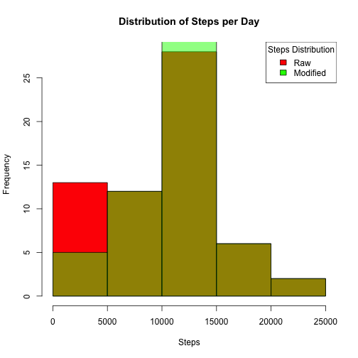

Loading and Processing the Data


The first chunk of R code reads in activity data associated with a personal activity monitoring device. This device collects data at 5 minute intervals through out the day. The data consists of two months of data from an anonymous individual collected during the months of October and November, 2012 and include the number of steps taken in 5 minute intervals each day. 

steps: Number of steps taking in a 5-minute interval (missing values are coded as NA)

date: The date on which the measurement was taken in YYYY-MM-DD format

interval: Identifier for the 5-minute interval in which measurement was taken


First code chunk reads and prepares the data for analysis by aggregating steps -- total, mean and median by date -- and performs a further aggregation of average steps by five minute interval.  Pre-processing is shown in this first code chunk.   Where there are no observations in a given day, we  must assume the user did not wear the device or the device was without power.  This is not the same as an NA in a specific interval -- in first observations, we allow NA's as is.


```r
        echo = TRUE
        setwd("~/Desktop/Coursera/RepData_PeerAssessment1")
        raw_data<-read.csv("activity.csv", colClasses=c("numeric", "Date", "numeric"))

        library(plyr)
        library(gplots)

        sum_steps<-aggregate(raw_data$steps, by=list(raw_data$date), FUN=sum, na.rm=TRUE)
        mean_steps<-aggregate(raw_data$steps,by=list(raw_data$date), FUN=mean, na.rm=TRUE)
        median_steps<-aggregate(raw_data$steps,by=list(raw_data$date), FUN=median, na.rm=TRUE)

        ## Note that if MEAN calculates a NAN, it is b/c there were zero observations for the day
        ## -- thus, we substitute a zero as truly no steps were logged
        ## This make no assumptions about NA's as they were omitted in the calculations above versus alternative assumptions
        ## -------------------------------

        mean_steps[2]<-unstack(within(stack(mean_steps), values[is.nan(values)] <- 0))
```

```
## Warning in stack.data.frame(mean_steps): non-vector columns will be
## ignored
```

```r
        ## ---------------------------------

        interval_steps<-aggregate(raw_data$steps, by=list(raw_data$interval), FUN=mean, na.rm=TRUE)

        aggregate_steps<-merge(mean_steps,median_steps,by="Group.1")
                               
        colnames(sum_steps) <- c("date", "total")                      
        colnames(aggregate_steps) <- c("date","mean", "median")

        colnames(interval_steps) <- c("interval", "mean")
```


What is mean total number of steps taken per day?

For this part of the assignment, you can ignore the missing values in the dataset.

        1. Make a histogram of the total number of steps taken each day
        2. Calculate and report the mean and median total number of steps taken per day

Histogram and mean / median report is shown in the next code chunks.


```r
        echo = TRUE
        hist(sum_steps$total, main="Distribution of Steps per Day", xlab="Steps", col="red")
```

 


```r
        textplot(aggregate_steps, show.rownames=FALSE)
        title("Mean and Median Steps per Day")
```

 


What is the average daily activity pattern?

        1.  Make a time series plot (i.e. type = "l") of the 5-minute interval (x-axis) and the average number of steps taken, averaged across all days (y-axis)
        2.  Which 5-minute interval, on average across all the days in the dataset, contains the maximum number of steps?
        
        
Time series plot and maximum interval report shown in the next code chunk.        


```r
        echo = TRUE
        with(interval_steps,
                plot(interval, mean, 
                 type="l", 
                 main="Average Steps at Daily Interval Measures",
                 ylab="5 Minute Interval",
                 xlab="Average Steps"
             ))
```

 


```r
        best_interval<-subset(interval_steps, mean == max(mean))
        textplot(best_interval, show.rownames=FALSE)
        title("Interval with Max Steps")
```

 


Imputing missing values

        Note that there are a number of days/intervals where there are missing values (coded as NA). 
        The presence of missing days may introduce bias into some calculations or summaries of the data.

        1.  Calculate and report the total number of missing values in the dataset (i.e. the total number of rows with NAs)
        2.  Devise a strategy for filling in all of the missing values in the dataset. 
            The strategy does not need to be sophisticated. For example, you could use the mean/median for that day, or the 
            mean for that 5-minute interval, etc.
            
Code chunk counts the NA's, substitutes the mean for the matching interval of the missing NA measurement at interval and re-runs the pre-processors for total, mean and median per day.


```r
        echo = TRUE
        number_na<-sum( is.na(raw_data$steps ) ) 
        modified_raw<-raw_data                                           ## new data frame for storing the modified data
      

        for (a in 1:nrow(raw_data)) {
                meanie<-subset(interval_steps, interval==raw_data[a,3])  ## load pre-calculated mean steps for matching interval
                if ((is.na(modified_raw[a,1]))==TRUE)  {                 ## replace the NA with the mean selected above 
                        modified_raw[a,1]<- meanie$mean }
        }

        mod_sum_steps<-aggregate(modified_raw$steps, by=list(modified_raw$date), FUN=sum, na.rm=TRUE)
        mod_mean_steps<-aggregate(modified_raw$steps,by=list(modified_raw$date), FUN=mean, na.rm=TRUE)
        mod_median_steps<-aggregate(modified_raw$steps,by=list(modified_raw$date), FUN=median, na.rm=TRUE)

        ## Note that if MEAN calculates a NAN, it is b/c there were zero observations for the day 
        ## -- thus, we substitute a zero as truly no steps were logged
        ## For the modified data set, we of course have already substituted MEAN for NA's.
        ## -------------------------------

        mod_mean_steps[2]<-unstack(within(stack(mod_mean_steps), values[is.nan(values)] <- 0))
```

```
## Warning in stack.data.frame(mod_mean_steps): non-vector columns will be
## ignored
```

```r
        ## ---------------------------------

        mod_interval_steps<-aggregate(modified_raw$steps, by=list(modified_raw$interval), FUN=mean, na.rm=TRUE)
        mod_aggregate_steps<-merge(mod_mean_steps,mod_median_steps,by="Group.1")
                               
        colnames(mod_sum_steps) <- c("date", "total")                      
        colnames(mod_aggregate_steps) <- c("date","mean", "median")
        colnames(mod_interval_steps) <- c("interval", "mean")
```


Create a new dataset that is equal to the original dataset but with the missing data filled in.

        1.  Make a histogram of the total number of steps taken each day and Calculate and report the mean and median total number 
        of steps taken per day. 
        2.  Do these values differ from the estimates from the first part of the assignment? 
        3.  What is the impact of imputing missing data on the estimates of the total daily number of steps?

The next code chunk overlays the two histograms showing differences using overlay / transparent colors -- 
The mean data changes significantly when substituting average intervals for NA's.
The subsequent table also shows differences for the overall mean and mod once interval mean values are substituted for NA's.  


```r
        echo = TRUE
        hist(sum_steps$total, main="Distribution of Steps per Day", xlab="Steps", col="red")
        hist(mod_sum_steps$total, add=T, col=rgb(0, 1, 0, 0.5))
        legend("topright", title="Steps Distribution" , c("Raw", "Modified"), fill=c("red", "green"))
```

 


```r
        textplot(mod_aggregate_steps, show.rownames=FALSE)
        title("Mean and Median Steps per Day - Modified" )
```

 


Are there differences in activity patterns between weekdays and weekends?

        For this part the weekdays() function may be of some help here. 
        Use the dataset with the filled-in missing values for this part.

        Create a new factor variable in the dataset with two levels – “weekday” and “weekend” indicating whether a 
        given date is a weekday or weekend day.

        Make a panel plot containing a time series plot (i.e. type = "l") of the 5-minute interval (x-axis) and the average 
        number of steps taken, averaged across all weekday days or weekend days (y-axis). 

The code below builds the additional column "days" and substitutes weekday and weekend values for the original names of the week.  Subsets are prepared for graphing and interval means calculated.  The analysis is then presented in a two pannel plot.  Processor and graphs are presented in a single code chunk.


```r
        echo = TRUE
        modified_raw$days<-weekdays(modified_raw$date)  

        modified_raw$days<-sub("Monday", "weekday", modified_raw$days)
        modified_raw$days<-sub("Tuesday", "weekday", modified_raw$days)
        modified_raw$days<-sub("Wednesday", "weekday", modified_raw$days)
        modified_raw$days<-sub("Thursday", "weekday", modified_raw$days)
        modified_raw$days<-sub("Friday", "weekday", modified_raw$days)
        modified_raw$days<-sub("Saturday", "weekend", modified_raw$days)
        modified_raw$days<-sub("Sunday", "weekend", modified_raw$days)

        weekdays<-subset(modified_raw, days=="weekday")
        weekends<-subset(modified_raw, days== "weekend")

        weekday_interval<-aggregate(weekdays$steps, by=list(weekdays$interval), FUN=mean, na.rm=TRUE)
        weekend_interval<-aggregate(weekends$steps, by=list(weekends$interval), FUN=mean, na.rm=TRUE)

        colnames(weekday_interval) <- c("interval", "mean")
        colnames(weekend_interval) <- c("interval", "mean")

        par(mfrow=c(2,1))
        with(weekday_interval,
                plot(interval, mean, 
                 type="l", 
                 main="Avg Weekday Steps at Daily Intervals",
                 ylab="5 Minute Interval",
                 xlab="Average Steps"
             ))
        with(weekend_interval,
                plot(interval, mean, 
                 type="l", 
                 main="Avg Weekend Steps at Daily Intervals",
                 ylab="5 Minute Interval",
                 xlab="Average Steps"
             ))
```

 
